                                     

<br>

# Instrucciones generales

-**Entorno:**Visual Studio 2022 (Community). Proyectos Windows Forms y Consola en C#.
- **Alcance del Tema 2:** tipos básicos, constantes y variables, operadores (aritméticos, relacionales, lógicos, concatenación, precedencia), expresiones/asignación, cadenas interpoladas (incl. formato), manejo de errores con try-catch, e introducción a consola.
- **Estilo de código (Microsoft):**
  - Variables y parámetros: camelCase (p. ej., precioNeto).
  - Constantes/propiedades: PascalCase (p. ej., Iva, TipoCambio).
  - Controles en Forms: txtNombre, lblResultado, btnCalcular, etc.
- **Buenas prácticas:**
  - Importes en decimal (sufijo m).
  - Parámetros fijos (IVA, retención) en const.
  - Salidas con cadenas interpoladas y formato (C2, P1, N0, …) cuando aplique.
  - En divisiones: controlar FormatException y DivideByZeroException (multi-catch).

## Índice de ejercicios

**Bloque A – Fundamentos (tipos, variables, constantes, expresiones)** → Ej. 1–4  
**Bloque B – Operadores y precedencia** → Ej. 5–10  
**Bloque C – Constantes y enumeraciones** → Ej. 11–13  
**Bloque D – Aplicaciones numéricas sin flujo** → Ej. 14–16  
**Bloque E – Consola (E/S básica)** → Ej. 17–18  
**Bloque F – Extra / ampliación** → Ej. 19–20  

<br>

# Bloque A – Fundamentos

## Ejercicio 1: Identificadores y tipos (papel)

**Objetivo:** fijar reglas de identificadores y elegir tipos básicos (int, decimal, bool, char, string, enum).

1.	Lee la lista de conceptos: Edad, Código Postal, DNI, Altura, Sexo, ¿Casado?, IVA a aplicar, Tipo de transporte (Coche, Tren, Avión, Barco).
2.	Para cada concepto:
  - Propón un identificador válido y adecuado.
  - Indica el tipo de datos más apropiado.
3.	Escribe en tu cuaderno o en un documento las respuestas.

## Ejercicio 2: string – concatenación vs interpolación

**Objetivo:** comparar legibilidad entre concatenación e interpolación.

Realizar un programa de **Windows Forms** que pida nombre y primer apellido y muestre el nombre completo en dos mensajes.

**Nota:** en el primer `MessageBox` construye el texto con concatenación (+) y en el segundo con cadena interpolada ($"...").

**Controles sugeridos:** txtNombre, txtApellido, btnMostrar. Al pulsar el botón, mostrar las dos variantes del mensaje.


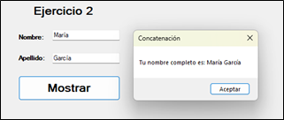
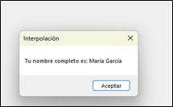

## Ejercicio 3: Reales double/float

**Objetivo:** diferenciar `double` de `float` (sufijo F).

Realizar un programa de **Windows Forms** que declare un `float`, un `double` y un `decimal` y muestre sus valores en `MessageBox`.

Nota: `float` → 32 bits (sufijo F), `double` → 64 bits (por defecto), `decimal` → base 10 para dinero (sufijo m).

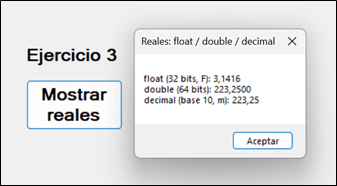

## Ejercicio 4a (Resuelto) (Windows Forms): Decimal básico – precio y descuento

**Realizar un programa de Windows Forms que pida un precio y un descuento (entre 0 y 1), calcule el neto y lo muestre por pantalla.**

**Nota:** trabaja con el tipo decimal y usa la fórmula neto = precio * (1 − descuento). Puedes construir los textos como prefieras (concatenación o interpolada).

**Código** (botón Calcular): 

```csharp
try
{
    decimal precio = decimal.Parse(txtPrecio.Text);
    decimal dto = decimal.Parse(txtDescuento.Text); // entre 0 y 1
 
    decimal neto = precio * (1 - dto);
 
    lblNeto.Text = "Neto: " + neto.ToString("C2");       // concatenación
}
catch (FormatException)
{
    MessageBox.Show("Introduce valores numéricos válidos en Precio y Descuento.",
                    "Error de formato");
}
```

**Prueba rápida.**

- Precio = 12,30 y Descuento = 0,15 → **Precio: 12,30 € · Dto: 15,0 % · Neto: 10,46 €**
  
- Precio = 19,99 y Descuento = **0,20 → Neto: 15,99 €**
- 
Nota: usa coma o punto según la configuración de tu Visual Studio. Si más adelante escribes literales en código (no leídos), recuerda el sufijo m: `decimal iva = 0.21m;`.

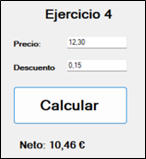

## Ejercicio 4b (Resuelto) (Consola): Decimal básico – precio y descuento

1.	Crea una Aplicación de consola llamada Tema2_Ej05.
2.	Pide por consola un precio (decimal) y un descuento entre 0 y 1 (por ejemplo, 0,15).
3.	Calcula el neto = precio * (1 – descuento) con decimal.
4.	Muestra por pantalla: precio (C2), descuento (P1) y neto (C2).
5.	Finaliza con Console.ReadKey().

Código (copia y pega en Program.cs):

```csharp
static void Main(string[] args)
{
    Console.Write("Precio (decimal): ");
    decimal precio = decimal.Parse(Console.ReadLine());
 
    Console.Write("Descuento (0-1): ");
    decimal dto = decimal.Parse(Console.ReadLine());
 
    decimal neto = precio * (1 - dto);
 
    Console.WriteLine($"Precio:   {precio:C2}");
    Console.WriteLine($"Dto:      {dto:P1}");
    Console.WriteLine($"Neto:     {neto:C2}");
 
    Console.WriteLine("Pulsa una tecla para salir...");
    Console.ReadKey(); 
}
```

**Prueba rápida.**

- Precio = 12,30 y Descuento = **0,15 → Precio: 12,30 € · Dto: 15,0 % · Neto: 10,46 €**
  
- Precio = 19,99 y Descuento = **0,20 → Neto: 15,99 €**
- 
**Nota:** usa coma o punto según la configuración de tu Visual Studio. Si más adelante escribes literales en código (no leídos), recuerda el sufijo m: `decimal iva = 0.21m;`.

<br>

# Bloque B – Operadores y precedencia

## Ejercicio 5: Traza de valores – tipos, casting y operadores

**Objetivo.** Analizar paso a paso cómo cambian las variables y qué resultado producen los operadores aritméticos, de conversión y lógicos.

1. **Antes de empezar**, indica de qué **tipo** debería ser cada variable y **declárala**.
Pista: `num1, num2, num3` son números enteros; `r1, r2, r3` son reales con decimales; `l1` es lógica (verdadero/falso).

2. Copia la siguiente **secuencia de instrucciones** y, **tras cada línea**, anota los nuevos valores que toman las variables.
   
3. No ejecutes en Visual Studio hasta el final. Primero hazlo “a mano” y justifica brevemente los casos dudosos (por ejemplo, división entera vs. real o precedencia de operadores).

```csharp
num1 = 10;
num2 = 20;
num3 = num1 + num2; 
num3 = num3 + 1;
num3++;

r1 = num1 / num2;
r1 = (double)num1 / (double)num2;
r2 = 2.0;
r3 = r2 / r1 - 1;
r3 = r2 / (r1 - 1);

l1 = num1 > num2;
l1 = (num1 > num2) && (num2 <= 20);
l1 = (num1 > num2) || (num2 <= 20);
l1 = (num1 < num2) || (num2 <= 20) && (num1 == 10);
l1 = ((num1 < num2) || (num2 <= 20)) && (num1 != 10);
l1 = !(((num1 < num2) || (num2 <= 20)) && (num1 != 10));
```

**Entrega.**

- Una tabla simple con **línea evaluada** → valores de `num1, num2, num3, r1, r2, r3, l1` y, cuando proceda, una frase de por qué (división entera/real, orden de operadores, cortocircuito, etc.).
 
## Ejercicio 6 (Resuelto): Pack aritmético

**Realizar un programa que lea dos valores de tipo entero** y muestre en pantalla los resultados de **suma, resta, producto, división entera y resto**.

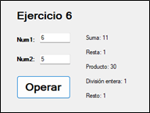

Añade un **try–catch (FormatException)** para controlar entradas no numéricas.

## Ejercicio 7(Resuelto): División segura + finally

**Objetivo:** multi-catch y limpieza con `finally`.

**Realizar un programa (Tema2_Ej07) que lea dos valores de tipo entero (`dividendo` y `divisor`) y muestre el cociente de la división entera en un Label.**

 Funcionamiento del botón “Dividir”:

1. Dentro de un `try`, convierte `txtDividendo.Text` y `txtDivisor.Text` a `int` con `int.Parse(...)`, calcula `cociente = dividendo / divisor;` (división entera) y escribe el resultado en `lblResultado` usando cadena interpolada.
   
2.	Añade `catch (FormatException)` para avisar si no se introducen números enteros válidos (`MessageBox`).

3.	Añade `catch (DivideByZeroException)` para avisar si el divisor es 0 (`MessageBox`).

4.	 Sobre `finally`: es un bloque que se ejecuta al terminar el try. Se usa para dejar el formulario en buen estado (por ejemplo, limpiar entradas y devolver el foco). En este ejercicio, en `finally` limpia `txtDividendo` y `txtDivisor` y hace `txtDividendo.Focus`

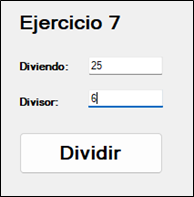
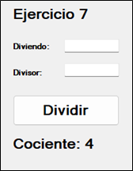


## Ejercicio 8: Probador de relacionales

**Objetivo:** practicar <, >, ==, !=.

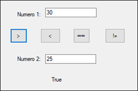

##Ejercicio 9: Lógicos y cortocircuito sin if

**Realizar un programa que lea dos valores de tipo entero (A y B) y muestre el resultado (True/False) de tres expresiones lógicas sin usar if: Tema2_Ej08**

- **Ambos positivos:** (A > 0) && (B > 0)
  
- **Alguno es cero:** (A == 0) || (B == 0)
  
- **A menor que B y B < 100:** (A < B) && (B < 100)

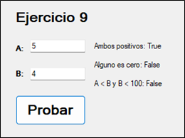


## Ejercicio 10: Precedencia de operadores(papel)

**Resuelve las siguientes expresiones teniendo en cuenta la precedencia de operadores:** hazlo en papel (parte se resolverá en clase) y sin ejecutar; escribe el resultado final de cada una e indica brevemente qué se evalúa antes; recuerda el orden: paréntesis → *, /, % → +, - → relacionales (<, >, <=, >=) → ==, != → ! → && → ||; señala si la división es entera o real cuando aparezca.orden de evaluación en C#.

- 2 + 3 * 5
- (2 + 3) * 5
- (5 + 2) == 7 && (3 > 1)
- (5 + 2) == 7 || (3 < 1)
- (!true) || (false && true)
- 10 / 3
- (1 + 2 * 3) == 7 || (4 % 2) == 0

<br>

# Bloque C – Constantes y enumeraciones

## Ejercicio 11  

Realizar un programa que lea la altura en cms de un individuo y muestre, en un label, cuántos metros y cms tiene. (185 -> 1 metro, 85 cms. 205-> 2 metros 5 cms.). 

Utilizar try – catch para la introducción del número. Realizar con un formulario de la siguiente forma:

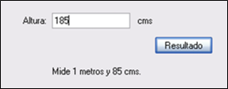

## Ejercicio 12: Cambio EUR↔PTS con constantes

Realizar un programa que cambie de pesetas a euros y viceversa. Utilizar try catch en la introducción de los valores

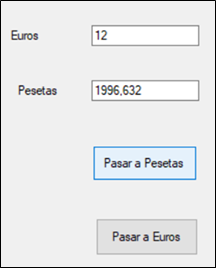

## Ejercicio 13: enum en acción (sin if)

**Objetivo:** uso básico de `enum` y `ToString()`.

**Realizar un programa para practicar los tipos enumerados:** declara en la clase del formulario `enum Estacion { Primavera, Verano, Otono, Invierno };` diseña un formulario como el de la figura en el que al pulsar cada botón, asigna una variable `Estacion est` con el valor correspondiente y muestra un MessageBox (usando solo concatenación) que incluya el nombre de la estación (con `est.ToString()`) y su valor numérico (con `(int)est`). 

El valor numérico es el entero subyacente de cada miembro del enumerado: por defecto empieza en 0 y aumenta de 1 en 1, aunque puedes asignar valores explícitos si lo necesitas (por ejemplo, Primavera=1, Verano=2, …). 

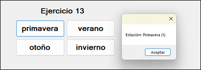

<br>

# Bloque D – Aplicaciones numéricas 

## Ejercicio 14: Productos (Consola)

En una tienda se adquieren tres productos. Introduciendo el precio de cada uno de los productos, mostrar por pantalla el importe total a abonar, sin IVA y con IVA, siendo éste del 21%.

```
  Ejemplo: Precios de los productos: 4,56 6,79 y 5,25.

  Solución:
  Precio total sin IVA: 16,6 euros
  Precio total con IVA: 20,086 euros
```

## Ejercicio 15: Capital con interés anual

**Objetivo:** formato monetario y porcentual.

Dada una cantidad ingresada en un banco por un cliente, y el interés anual, calcular el capital que tendría a final del año.

```
  Ejemplo: Si el cliente tiene 1000 euros en su cuenta y el interés anual es del 5 %.

  Solución: Capital final: 1050 euros.
```

## Ejercicio 16: Nómina base 

**Objetivo:** importes en `decimal` y retención.

Un trabajador a lo largo del mes trabaja un número de horas normales y un número de horas extras. Las horas extras se pagan el doble que las horas normales. Realizar un programa en el que se introduzcan el número de horas trabajadas (normales y extras) y la paga por hora normal, y se calcule la nómina mensual, aplicando una retención del 18%.

```
  Ejemplo: Horas normales: 160, horas extra: 6 y precio/hora: 12 euros.
  
  Solución: 
  Nómina mensual sin retención: 2064 euros
  Nómina mensual:  1692,48 euros.
```
<br>

# Bloque E – Consola (E/S básica)

Crea proyectos de **Aplicación de Consola**. Añade `Console.ReadKey()` al final.
 
## Ejercicio 17: Hola

**Realizar un programa de consola que pida el nombre y la edad** y muestre un saludo y **la edad en meses**. Tema2_Ej17 (Aplicación de Consola).

**Nota:** Para calcular los meses, simplemente multiplica la edad por 12.

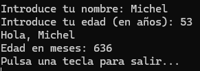

## Ejercicio 18: (precio + descuento)

**Realizar un programa de consola que pida un precio y un descuento (entre 0 y 1), calcule el neto y lo muestre por pantalla. Tema2_Ej20** (Aplicación de Consola).

**Nota:** trabaja con el tipo decimal y usa la fórmula neto = precio * (1 − descuento).

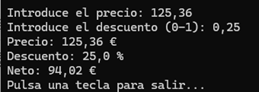

<br>

# Bloque F – Extra / ampliación 

## Ejercicio 19: Formateo numérico avanzado

**Realizar un programa de consola que pida un número decimal y lo muestre en cuatro formatos: N0, N2, C2 y P2. Tema2_Ej23** (Aplicación de Consola).

**Nota:** trabaja con decimal. Muestra el mismo valor en líneas separadas con los formatos:  
N0 (sin decimales), N2 (dos decimales), C2 (moneda), P2 (porcentaje). 

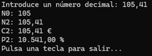

## Ejercicio 20: char – vocal y dígito (resolver)

**Realizar un programa de consola que pida un único carácter y muestre si es una vocal y si es un dígito. Tema2_Ej24** (Aplicación de Consola).

**Nota:** considera vocales a, e, i, o, u en  minúscula; dígito entre '0' y '9'. Calcula ambas respuestas con expresiones booleanas (sin usar if). 

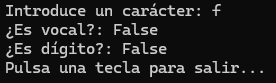

**Plantillas y guías rápidas (Forms)**

- **Nombres de controles:** `txt*` (entrada), `lbl*` (salida), `btn*` (acción), `cmb*` (listas), `nud*` (numéricos), etc.
  
- **Eventos:** usar `Click` en botones; el código de cada ejercicio va en el `Click` correspondiente.
  
- **Limpieza y foco** (cuando se pida): `TextBox.Clear()` y `Control.Focus()` dentro de `finally`
  
- **Convenciones:** constantes al inicio de la clase del formulario; variables locales dentro del evento.


